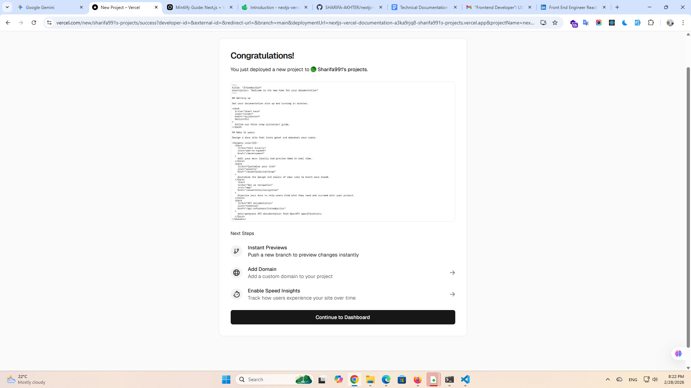

# Connecting to Vercel

Vercel provides a seamless experience for deploying Next.js applications directly from GitHub.

### Step 1: Import Project
1. Log in to [Vercel](https://nextjs-vercel-documentation.vercel.app).
2. Click **Add New** > **Project**.
3. Select your GitHub repository and click **Import**.

### Step 2: Deploy
Click the **Deploy** button. Vercel will automatically build your project and provide a production-ready URL in a few minutes.

### Successful Deployment

*Caption: The project is now live on Vercel.*

### Deployment Success
Congratulations! Your Next.js application is now live and accessible globally.

*Caption: The successful live preview of the Next.js application on Vercel.*